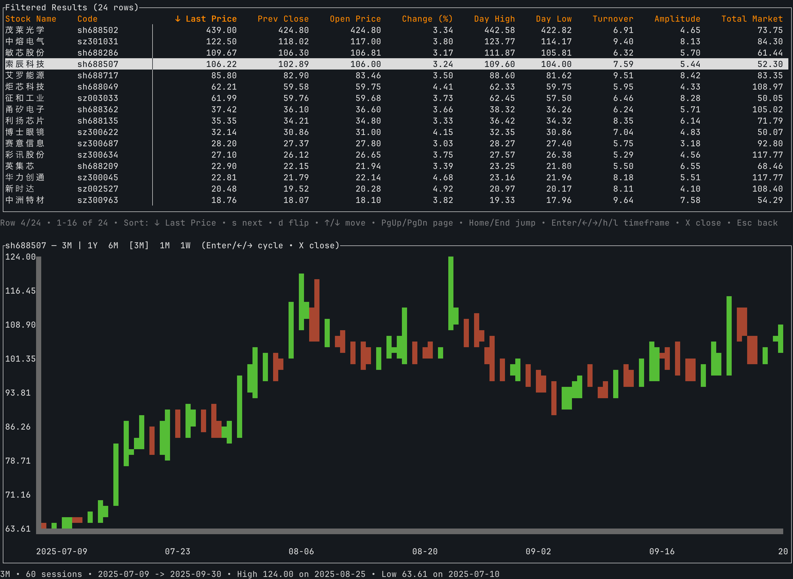

# Stock CLI

Stock CLI is a terminal-first companion for exploring the China A-share market. It grabs live quotes from Tencent, writes timestamped CSV snapshots, and drives a Ratatui UI that lets you filter, sort, and inspect interactive candlestick charts. The configuration remains extensible so additional markets can be added later.

## What It Does
- Fetch live market data: read stock codes from `stock_code.csv`, request real-time quotes, and surface price, turnover, amplitude, and other key metrics.
- Filter the results: configure threshold ranges, save them as reusable presets, and reload them on demand.
- Visualize history: pull up to 420 days of candles for the selected symbol and inspect multiple time ranges directly from the results screen.
- Manage CSVs: every fetch emits a timestamped file under `assets/snapshots/cn/`, making it easy to revisit previous trading sessions.

## Getting Started
- Install tooling: make sure the stable Rust toolchain (with `cargo`) is available.
- Clone the repo: `git clone <repo-url> && cd stock-cli`
- Build the binary: `cargo build --release`
- Provide stock codes: place `stock_code.csv` alongside the executable (one symbol per line for the China market). To add future markets, drop a CSV into `assets/.markets/` and register it in the configuration.
- Launch the app: `./target/release/stock-cli` (or `cargo run` while developing).

## Using The TUI
- Main menu
  - `Show Filtered` – browse stocks that pass the active thresholds; use `s` to change the sort column, `d` to toggle direction, Enter to open the inline chart, and `←/→` to swap the displayed time range.
  - `Filters` – edit lower/upper bounds, save presets, or load existing ones. Within the editor, Tab or the arrow keys jump between fields; Enter saves the change.
  - `Refresh Data` – fetch the latest snapshot and persist it to disk.
  - `Load CSV` – pick a historical snapshot from `assets/snapshots/` to explore.
  - `Quit` – exit the program. (When more than one region is configured, a `Switch Market` option appears automatically.)
- Navigation cheatsheet
  - Arrow keys or `j/k` move the selection.
  - `Enter` confirms, `Esc` steps back, `Ctrl+C` aborts immediately.
- Suggested flow
  1. Start with `Refresh Data` to capture current quotes.
  2. Adjust filters until the result list matches your criteria.
  3. Open `Show Filtered`, scan the table, and inspect the inline charts.
  4. Save thresholds or load prior CSV snapshots as needed.

## Data Layout & Extensibility
- Stock universe: `stock_code.csv` (required). New markets belong in `assets/.markets/<region>.csv`.
- Snapshots: stored in `assets/snapshots/<region>/`.
- Filter presets: stored in `assets/filters/<region>/`.
- Adding another region: implement a configuration module in `src/config/`, register it in `Config::builtin`, and reuse the existing fetch and UI flows.
