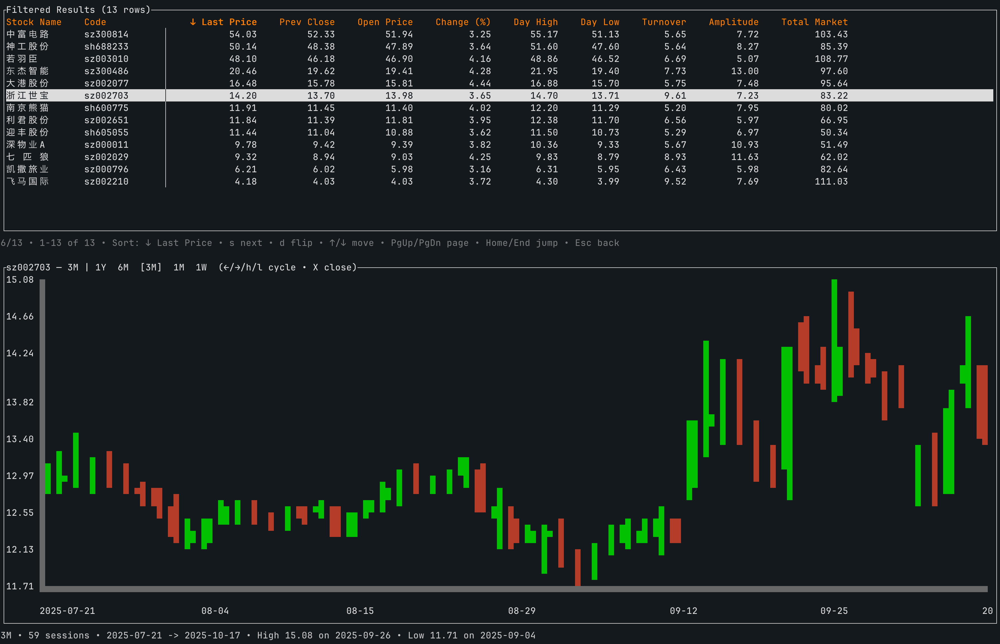

# Stock CLI

Stock CLI is a Ratatui-based terminal assistant for A-share screening: it captures real-time snapshots, renders rotating multi-range K-line charts, and loads markets from declarative descriptors so new regions can be added by dropping CSV/JSON assets alongside the binary.

Learn more about the full feature set:
- [English README](./docs/README_en.md)
- [中文说明](./docs/README_zh.md)

## Deployment Options
- **Source build (requires Rust)** – install the stable toolchain, run `cargo build --release`, and distribute the resulting binary together with the `assets/` directory.
- **Prebuilt archive (no Rust needed)** – download the packaged release, extract it, run `./deploy.sh` (or `./deploy.sh /path/to/stock-cli`) once to remove the macOS quarantine flag, then start `stock-cli`.
