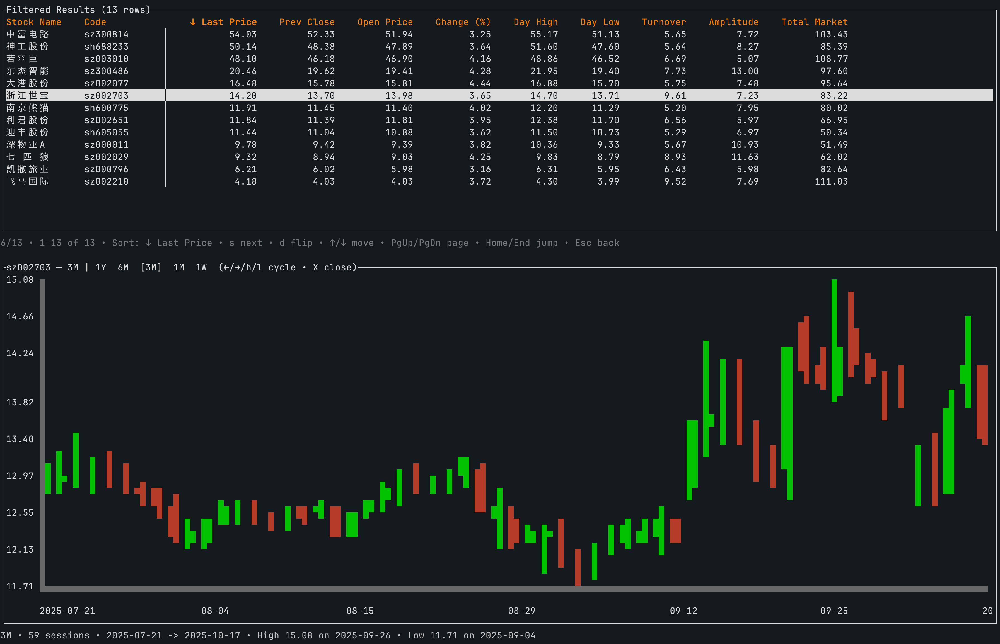
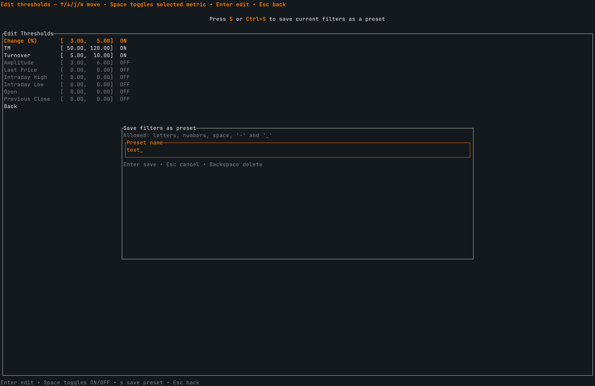

# Stock CLI

Stock CLI is a Ratatui-powered terminal companion for screening equity markets. It currently ships with a single descriptor for China A-shares (Shanghai & Shenzhen) and relies on declarative configuration so you can add new regions without touching Rust code.

## Current Coverage
- The bundled `CN` region points to `assets/.markets/cn.csv`, combining Shenzhen (SZ) and Shanghai (SH) listings. No other exchanges are enabled out of the box.
- Market metadata, request templates, and default thresholds live in `assets/configs/cn.json`. The app bootstraps entirely from this descriptor at runtime, so updating the CSV or JSON is enough to refresh the universe.

## Snapshot & History Capture
- Whenever you refresh data, Stock CLI reads the active region list from `assets/.markets/<region>.csv` and requests live snapshots for every symbol. Responses are persisted as timestamped CSVs under `assets/snapshots/<region>/`.
- The same process pulls up to a full year of historical candles for each instrument. These daily OHLC rows feed the K-line charts and are cached to avoid redundant calls during a session.
- Snapshot pipelines understand provider-specific quirks (including Tencent firewall warnings) by following the JSON mapping declared in each region descriptor.

## Screening & K-Line Exploration
- Region descriptors define metric thresholds such as turnover, amplitude, and price change. When you choose *Show Filtered*, the app applies the active filter to the latest snapshot, surfaces matching tickers, and offers them as stock-picking suggestions.
- Selecting a row opens the inline K-line canvas. The chart automatically cycles through one year, six months, three months, one month, and one week windows so you can compare recent momentum without leaving the list.
- Sorting (`s`) and direction toggles (`d`) let you prioritize symbols that meet your strategy while the chart updates in place alongside the table.

## Custom Filter Presets

- The *Filters* screen exposes every threshold declared in the region JSON, allows you to enable or disable metrics, and saves changes under `assets/filters/<region>/`.
- Presets can be saved with custom names, quickly reloaded, and are re-applied across sessions so you can maintain multiple strategies per market without editing code.

## Extending the Market Catalogue
Detailed configuration is the heart of Stock CLI, and you can replicate the CN setup to support any other exchange.

.png)
.png)

1. **Start from the template** – copy `docs/examples/sample_region.json` into `assets/configs/<your_region>.json`. Replace the `code`, `name`, and `stock_list.file` fields to match your market. The screenshots above highlight how request templates and response mappings line up with remote APIs.
2. **Describe data ingestion** – fill in the `provider.snapshot` and `provider.history` sections:
   - `url_template` and optional headers control how the CLI issues HTTP calls.
   - `response` blocks specify how to map JSON fields into the unified snapshot table or historical OHLC rows.
   - Adjust `limit` if the new market exposes a different lookback length.
3. **Provide the instrument list** – create `assets/.markets/<your_region>.csv` with the tickers and any extra columns referenced by the descriptor.
4. **Reload the app** – restart the CLI or trigger the *Reload Markets* command from the UI. The new region appears in the market selector, enabling snapshots, history downloads, and filter presets for your custom exchange.

Because controllers and UI components only touch the `RegionDescriptor`, you can iterate on CSV and JSON files while the application is running, making it easy to validate new markets.

## Runtime Layout
- Live snapshots: `assets/snapshots/<region>/timestamp.csv`
- Saved filters: `assets/filters/<region>/*.json`
- Market manifests: `assets/.markets/<region>.csv`
- Region descriptors: `assets/configs/<region>.json`

Keep runtime outputs under `assets/snapshots/` and `assets/filters/` so that version control stays clean.

## Build & Deploy
- **Option 1 – Build from source** (requires local Rust toolchain)
  - Install the current stable toolchain: `rustup toolchain install stable`.
  - Build in release mode: `cargo build --release` (binary at `target/release/stock-cli`).
  - During development, run `cargo run` to start the TUI with debug logs.
  - Before distributing, run `cargo fmt`, `cargo clippy -- -D warnings`, and `cargo test`.
  - When sharing your build, bundle the binary alongside the `assets/` directory so descriptors, snapshots, and presets remain available.
- **Option 2 – Use the packaged release** (no Rust environment required)
  - Download the prebuilt macOS archive, unpack it, and run `./deploy.sh` (or `./deploy.sh /path/to/stock-cli`) once. The script executes `xattr -d -r com.apple.quarantine` on the binary so Gatekeeper allows it to launch.
  - After quarantine removal, run the bundled `stock-cli` directly.
