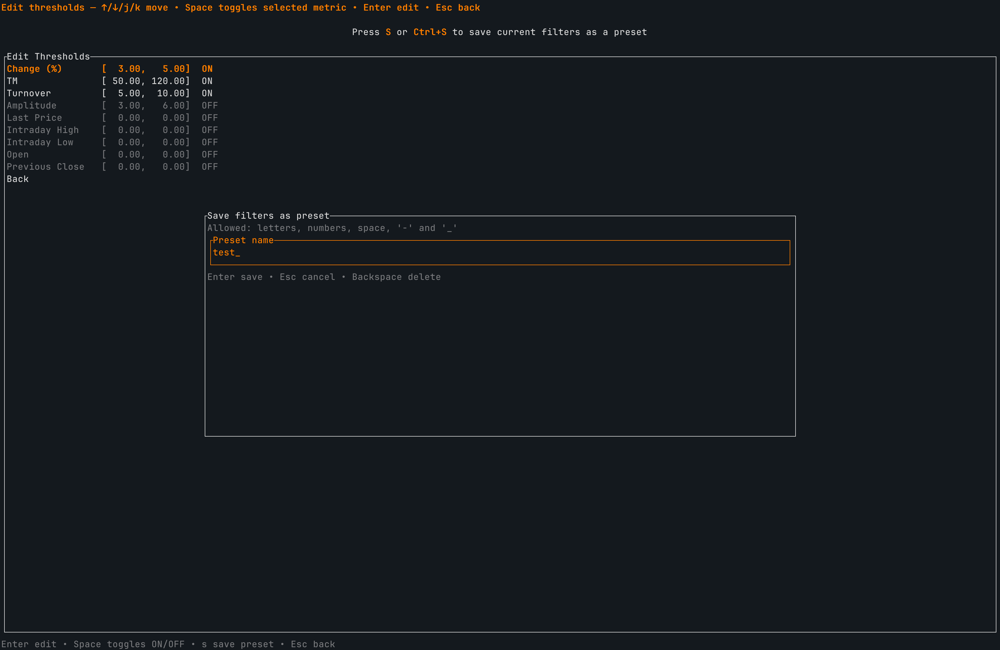

# Stock CLI

Stock CLI 是一个基于 Ratatui 构建的终端行情与选股工具，目前默认仅支持沪深 A 股（上海、深圳）。应用通过声明式配置驱动，后续扩展新市场时无需修改 Rust 代码。

## 当前覆盖范围
- 默认区域 `CN` 读取 `assets/.markets/cn.csv`，其中同时包含深交所（SZ）与上交所（SH）的股票列表，其他市场默认不启用。
- 区域元数据、网络请求模板以及默认阈值定义在 `assets/configs/cn.json` 中。程序启动时仅依赖该描述符加载市场信息，更新 CSV 或 JSON 即可刷新可用股票。

## 实时快照与历史数据
- 每次执行刷新时，应用会从 `assets/.markets/<region>.csv` 遍历股票代码，批量请求实时行情，并将响应写入 `assets/snapshots/<region>/` 下按时间戳命名的 CSV。
- 同步抓取最长一年的日线历史数据，为 K 线视图提供 OHLC 序列，并在同一会话中缓存以减少重复请求。
- 所有字段解析和防火墙判定均由区域描述符中的 JSON 映射完成，避免在抓取逻辑中硬编码供应商细节。

## 筛选与 K 线联动
- 区域配置预置了换手率、振幅、涨跌幅等过滤指标。在界面中选择 *Show Filtered* 时，系统会对最新快照应用当前筛选器，输出符合条件的股票清单作为选股建议。
- 进入某个条目即可展开联动的 K 线图，默认自动在一年、半年、三个月、一个月与一周的时间范围之间切换，帮助快速对比不同周期的走势。
- 列表支持 `s` 选择排序字段、`d` 切换升降序，方便在筛选结果中快速定位目标。

## 自定义筛选器预设

- *Filters* 界面展示了区域 JSON 中声明的全部指标，可调整上下限或开关后即时生效，并保存至 `assets/filters/<region>/`。
- 预设支持命名存储与快速加载，程序会在重启后自动还原上次选中的策略，无需反复手动输入。

## 扩展新的市场
Stock CLI 的核心是区域描述符，只要准备好 CSV 与 JSON，即可将其他市场同样纳入选股流程。

.png)
.png)

1. **从模板开始**：复制 `docs/examples/sample_region.json` 为 `assets/configs/<your_region>.json`，修改 `code`、`name` 与 `stock_list.file` 指向新的市场。上图展示了请求模板与结果映射之间的对应关系。
2. **完善抓取配置**：补全 `provider.snapshot` 与 `provider.history`：
   - 通过 `url_template` 与可选 `headers` 描述请求方式。
   - 在 `response` 段声明 JSON 字段如何映射到统一的快照或历史表结构。
   - 如果目标市场提供的历史长度不同，可调整 `limit` 数值。
3. **准备股票清单**：在 `assets/.markets/<your_region>.csv` 中列出所有交易代码及描述符需要的额外列。
4. **重新加载市场**：重启程序或在界面中触发 *Reload Markets*，新区域即可在市场选择器中出现，随即获得实时快照、历史数据与筛选器支持。

由于控制器与 UI 仅和 `RegionDescriptor` 交互，你可以在程序运行期间迭代 CSV/JSON 文件，快速验证新市场的配置。

## 运行时目录结构
- 实时快照：`assets/snapshots/<region>/timestamp.csv`
- 筛选预设：`assets/filters/<region>/*.json`
- 市场清单：`assets/.markets/<region>.csv`
- 区域描述符：`assets/configs/<region>.json`

运行时写入请保持在 `assets/snapshots/` 与 `assets/filters/` 下，避免污染版本库。

## 构建与部署
- 安装最新稳定版 Rust 工具链（`rustup toolchain install stable`）。
- 发布构建：`cargo build --release`（生成的可执行文件位于 `target/release/stock-cli`）。
- 开发调试可直接运行 `cargo run`，并查看终端日志。
- 发布前建议执行：
  - `cargo fmt`
  - `cargo clippy -- -D warnings`
  - `cargo test`
- 将程序部署到其他机器时，请同时拷贝编译产物与 `assets/` 目录，以保留市场配置、快照及筛选预设。
